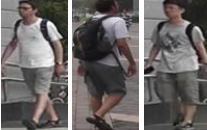
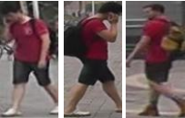
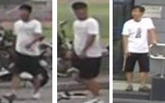

# Person Re-Identification

## 1️⃣ Introduction

### What is Person Re-Identification (Re-ID)?
Person Re-Identification (Re-ID) is a computer vision task that aims to recognize and match individuals across multiple non-overlapping camera views. It is widely used in surveillance, pedestrian tracking, and smart city applications. The main challenges in Re-ID include variations in lighting, pose, occlusion, and background clutter.

### About this Project
This project focuses on implementing **Person Re-ID using OSNet**, a state-of-the-art lightweight deep learning model specifically designed for re-identification tasks. OSNet effectively captures multi-scale discriminative features while maintaining high efficiency.

### Key Features
- **Deep Learning Framework:** PyTorch
- **Backbone Model:** OSNet
- **Datasets Used:** CUHK03
- **Evaluation Metrics:** Mean Average Precision (mAP), Rank-1 Accuracy
- **Applications:** Security surveillance, pedestrian analysis, forensic investigations

### Example Use Case
Given a query image of a person, the model searches a gallery dataset to find the most similar identities, ranking them based on similarity scores.

#### Example visualization:

<table>
    <tr>
        <td></td>
        <td></td>
    </tr>
    <tr>
        <td></td>
        <td></td>
    </tr>
</table>


This repository provides an end-to-end pipeline for training, evaluating, and deploying a Re-ID model using OSNet. In the following sections, I will guide you through the setup, training, and evaluation process.

## 2️⃣ Installation & Setup
### Prerequisites
Before running the project, ensure you have the following dependencies installed:
- Python
- PyTorch
- Torchvision
- NumPy
- OpenCV
- Matplotlib
- scikit-learn
- tqdm

You can install them using:
```bash
pip install -r requirements.txt
```

### Setting Up the Dataset
1. Download the `CUHK03` dataset from the official sources.
2. Extract the dataset and place it in the `data/` folder.
3. Ensure the dataset folder structure follows:
   ```
   data/
   ├── cuhk03/
   │   ├── archive
   │   │    ├── ...
   │   ├── pairs.csv
   ```

### Running the Code
To train the model, use:
```bash
python src/trainer.py
```

To evaluate the model, run:
```bash
updating...
```

To perform inference on a new image:
```bash
updating...
```